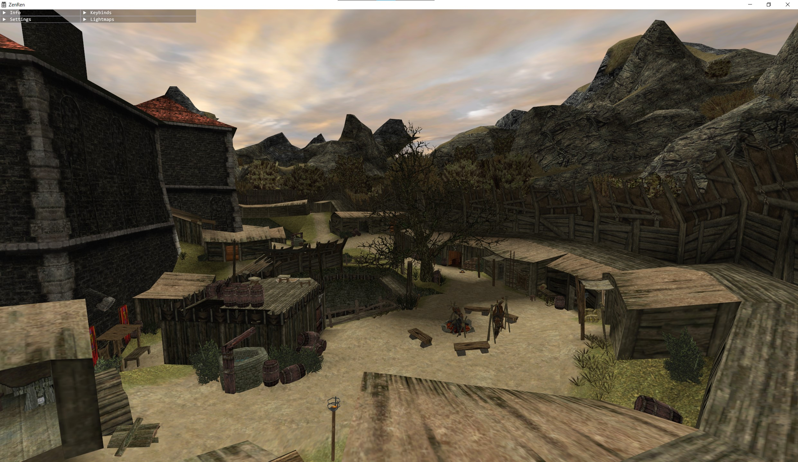
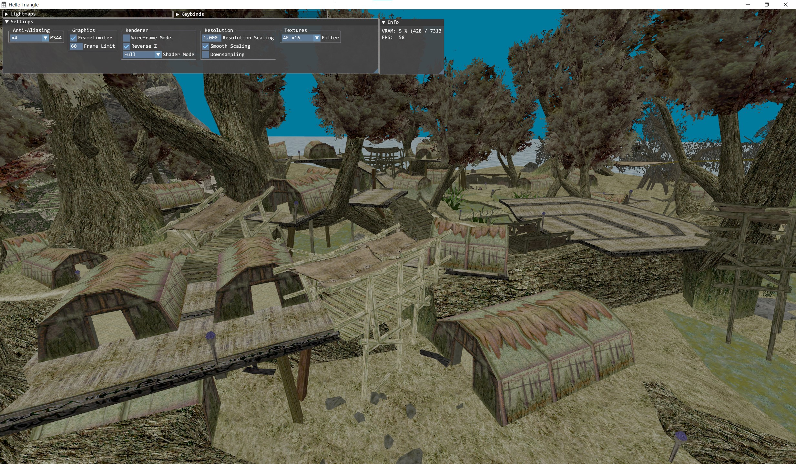
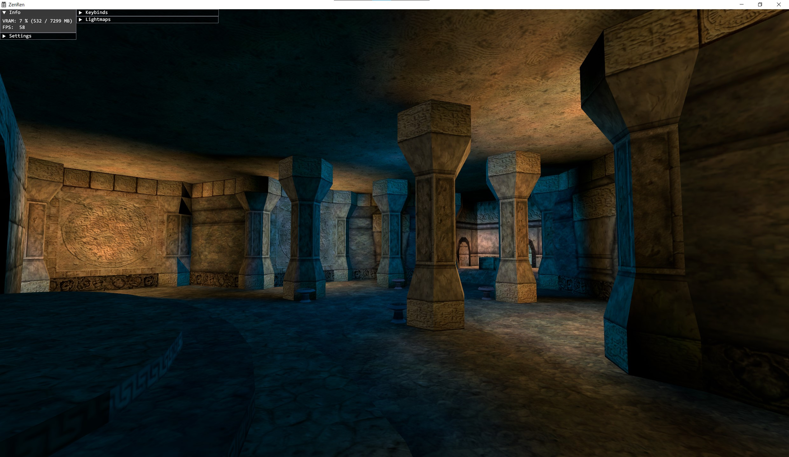

# ZenRen

High performance 3D viewer for Gothic 1 & 2 levels & assets (VDF or single files).
<br>Uses a custom renderer that attempts to closely recreate original G1/G2-AddOn look and lighting.

Requires a DirectX 11 capable GPU.

### ⭳ Download (Windows) & How-To-Use
- https://github.com/Katharsas/ZenRen/releases/latest

### Options
<pre>
  --level     Level ZEN name.
                Example: "WORLD.ZEN"
				 
  --vdfDir    Root dir containing VDFs to be loaded (will check all subfolders).
                Example: "C:\Program Files (x86)\Steam\steamapps\common\Gothic"
				 
  --assetDir  Root dir containing additional assets (will check all subfolders).
                Currently supports .TGA files.
                Example: ".\my-mod-assets"
</pre>

### Screenshots




### Build (Windows 10+ only)
- Install Visual Studio 2022+ (Desktop C++)
- Install Windows 11 SDK (any version, also works on Windows 10, can be installed through VS Installer)
- **Visual Studio CMake** (recommended)
  - Enable `CMakePresets.json` in Tools -> Options -> CMake -> General
  - Configure run arguments in [launch.vs.json](launch.vs.json)
  - Build and run target `ninja-x64-release` with `zenren.exe` startup item
- **CMake CLI or GUI**
  - Install CMake version 3.25 or higher (CMake 4.xx not yet supported!)
  - Install Ninja by running `winget install Ninja-build.Ninja`
  - Find `x64 Native Tools Command Prompt for VS 2022` in your start menu and run it
  - Navigate to the repository and run
      ```
      cmake --preset ninja-x64-release
      cmake --build --preset ninja-x64-release
      cmake --install out/build/ninja-x64-release
      ```
  - EXE and resources will be copied to `out/install/ninja-x64-release`
- The logfile `ZenRen.log.txt` might contain useful info if a problem occurs!

## Features

### Currently supports
- Worldmesh (ZEN)
- Static Objects (VOBs, MOBs, Decals)
- Static Lighting like in G1/G2 (Baked Lighting, Static Lights)
- Distance Fog
- Sky
  - Time-Of-Day Skylight
  - Sky Layer Animation
- Asset File Formats
  - Single Files or VDF/MOD Container
  - Level: ZEN
  - Objects: MRM, MDL, MDM+MDH
  - Textures: TEX, TGA, PNG

### Renderer Overview
- Frame Limiter
- Forward Renderer
  - Linear Colors
  - MSAA
  - Transparency Multisampling (Alpha-To-Coverage with Sharpening)
  - Resolution Scaling (up to 4x SSAA equivalent)
  - Transparent / Blended Surfaces
- Static Geometry
  - Preprocessing
    - Asset Data Validation (Normals, MipMaps, etc.)
    - Pre-Instantiation into 2D Morton Grid Cells
    - Texture/Material Batching
    - LOD Generation
  - Rendering
    - Merging of adjacent Cell's Draw Calls
    - Per-Cell Frustum Culling
- Static Lighting
  - Level
    - Lightmaps
    - Per-Vertex Baked Brightness 
  - Per Object
    - Precalculate single "accumulated" Light from all visible Static Lights
    - Sample Color from Ground Face
- Postprocessing
  - Tonemapping
  - Gamma, Brightness, Contrast
- UI
  - Detailed Settings
  - High DPI Aware

### TODO
- Effects
- Dynamic Lights
- Dynamic Objects
  - Light Updates
- Transparent Surface Sorting
- Sky Celestials (Sun, Moon)
- Asset File Formats
  - Objects: 3DS, MDS
- Loading single objects without level

### Non-Goals
- Animations
  - Morph-Meshes
  - Skeletal Animations

## License

**Copyright (c) 2024 - Jan Mothes**

This project's first-party code is "source available" for now.

### Third-Party
- lib/DirectXMath - MIT
- lib/DirectXTex - MIT
- lib/g3log - Public Domain / Unlicense
- lib/imgui - MIT
- lib/magic_enum - MIT
- lib/octree_attcs - MIT
- lib/tinyobj - MIT
- lib/ZenKit - MIT
- lib/meshoptimizer - MIT
