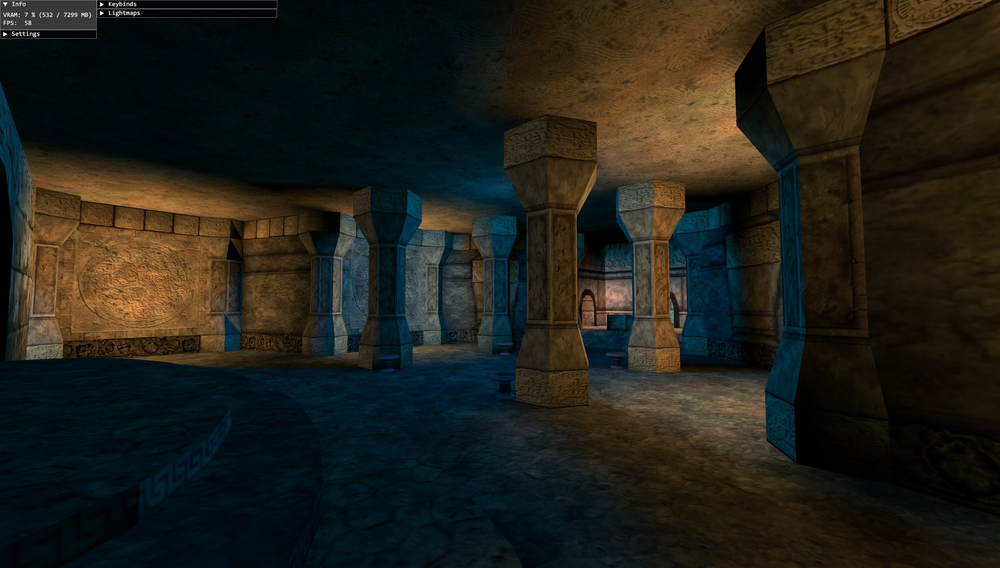

# ZenRen

Simple, high performance DirectX11.1 renderer for Gothic assets (VDF or single files).

### Download (Windows)
- https://github.com/Katharsas/ZenRen/releases/latest

### Currently supports
- Worldmesh (ZEN)
- Static Objects (VOBs)
- Static Light
  - Lightmaps
  - Per-Vertex Colors
  - Per-Vob Static Light Accumulation (Color & Direction)

### Features
- Frame Limiter
- Simple Forward Renderer
  - Linear Colors
  - MSAA, up to 4x SMAA
  - Transparency Multisampling (Alpha-To-Coverage with Sharpening)
  - Resolution Scaling
  - Depth Prepass
- Postprocessing
  - Tonemapping
  - Gamma, Brightness, Contrast
- UI (ImGUI)
  - High DPI Aware

### TODO
- Sky
- Water / Morph-Meshes
- Time Of Day (Gothic LUT Tonemapping)

### Options
<pre>
  --level     Level ZEN name.
                Example: "WORLD.ZEN"
				 
  --vdfDir    Root dir containing VDFs to be loaded (will check all subfolders).
                Example: "C:\Program Files (x86)\Steam\steamapps\common\Gothic"
				 
  --assetDir  Root dir containing additional assets (will check all subfolders).
                Currently supports .TGA files.
                Example: ".\my-mod-assets"
</pre>

### Screenshots

