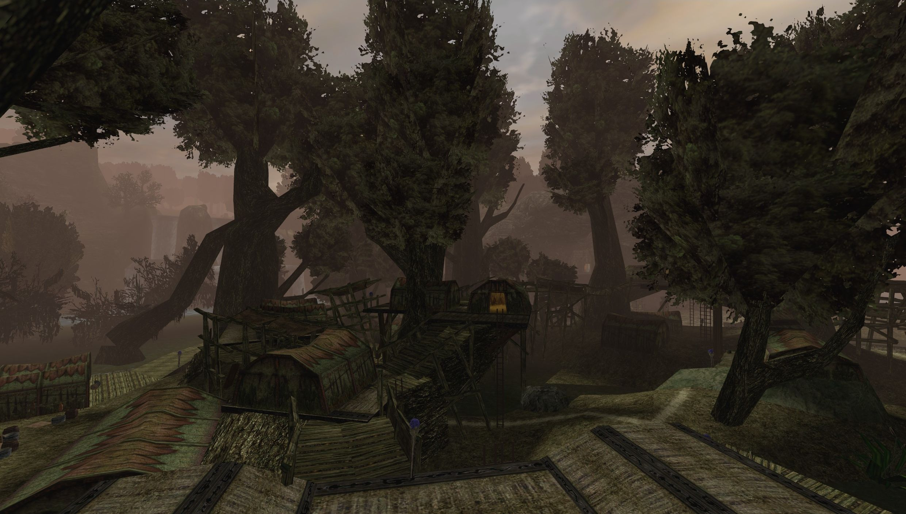

# ZenRen

High performance DirectX11 viewer/renderer for Gothic assets (VDF or single files).
 Attempts to closely recreate original G1/G2-AddOn look and lighting.

### Download (Windows)
- https://github.com/Katharsas/ZenRen/releases/latest

### Currently supports
- Worldmesh (ZEN)
  - Static Light
    - Indoor: Lightmaps
    - Outdoor: Per-Vertex Baked Brightness 
- Static Objects (VOBs, MOBs, Decals)
  - Static Light
    - Indoor: Static Voblight Accumulation (Color & Direction, Visibility Ray Testing)
    - Outdoor: Per-Vob Color from Ground Face
- Transparent / Blended Surfaces
- Distance Fog
- Sky
  - Time-Of-Day Skylight
  - Sky Layer Animation
- Asset File Formats
  - Single Files or VDF/MOD Container
  - Level: ZEN
  - Objects: MRM, MDL, MDM+MDH
  - Textures: TEX, TGA, PNG

### Features
- Frame Limiter
- Forward Renderer
  - Linear Colors
  - MSAA
  - Transparency Multisampling (Alpha-To-Coverage with Sharpening)
  - Resolution Scaling (up to 4x SSAA equivalent)
- Postprocessing
  - Tonemapping
  - Gamma, Brightness, Contrast
- UI
  - Detailed Settings
  - High DPI Aware

### TODO
- Effects
- Dynamic Lights
- Dynamic Objects
  - Light Updates
- Transparent Surface Sorting
- Sky Celestials (Sun, Moon)
- Asset File Formats
  - Objects: 3DS, MDS
- Loading single objects without level

### Non-Goals
- Animations
  - Morph-Meshes
  - Skeletal Animations

### Options
<pre>
  --level     Level ZEN name.
                Example: "WORLD.ZEN"
				 
  --vdfDir    Root dir containing VDFs to be loaded (will check all subfolders).
                Example: "C:\Program Files (x86)\Steam\steamapps\common\Gothic"
				 
  --assetDir  Root dir containing additional assets (will check all subfolders).
                Currently supports .TGA files.
                Example: ".\my-mod-assets"
</pre>

### Screenshots

## License

**Copyright (c) 2024 - Jan Mothes**

This project's first-party code is "source available" for now.

### Third-Party
- lib/DirectXMath - MIT
- lib/DirectXTex - MIT
- lib/g3log - Public Domain / Unlicense
- lib/imgui - MIT
- lib/magic_enum - MIT
- lib/octree_attcs - MIT
- lib/tinyobj - MIT
- lib/ZenKit - MIT
- lib/meshoptimizer - MIT